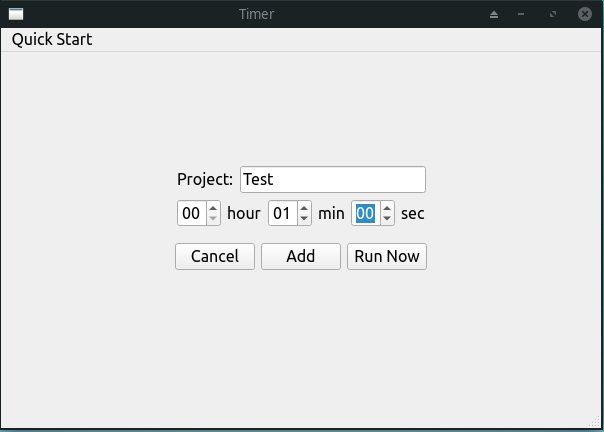
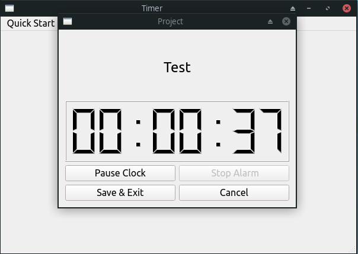
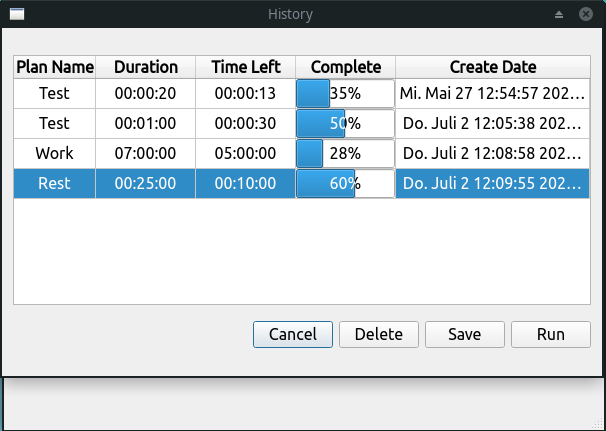
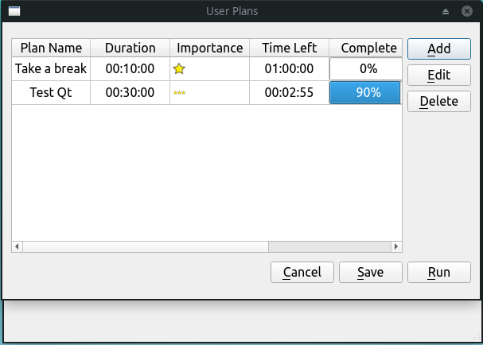
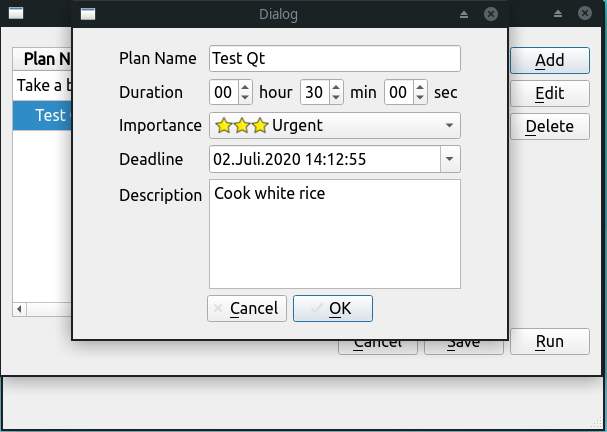

# Timer
> A simple countdown timer designed by Qt

## Table of contents
* [General info](#general-info)
* [Screenshots](#screenshots)

## General info
You can use this app to control your projects.

## Screenshots
This is the main page of the Timer app, here you can add your planed project, or just run a temporary project.

The running example. You can choose to pause the countdown clock, cancle the countdown, stop the ringing alarm or save the unfinished countdown clock.

Any runned projects will be showed in history(Quick Start | History). You can modify, delete any projects you want.

Any projects you added are showed here.(Quick Start | User Plans)

You can select and edit any single projects in user plans

